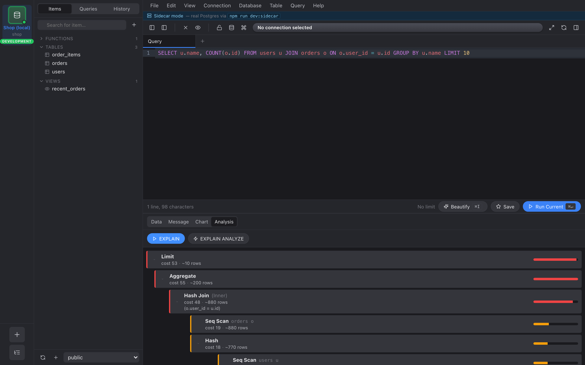

The **Analysis** tab in any query view runs `EXPLAIN` (or `EXPLAIN
ANALYZE`) for the current SQL and renders the plan as a hierarchy.

## EXPLAIN vs EXPLAIN ANALYZE

- **EXPLAIN** — the planner's cost estimate. No execution, safe on
  production.
- **EXPLAIN ANALYZE** — actually runs the query and measures every
  node. We wrap it in `(ANALYZE, VERBOSE, BUFFERS, SETTINGS, FORMAT
  JSON)` so you also get buffer / IO counters and the relevant
  planner GUC values.

## Reading the tree

Each node shows:

- **Node type** — Seq Scan / Index Scan / Hash Join / Sort / …
- **Target** — table, alias, or index name when applicable.
- **Cost or actual time** — when ANALYZE is on, you get the real
  number; otherwise the planner's `Total Cost`.
- **Rows** — actual row count × loops when ANALYZE is on, planner
  estimate otherwise.
- **Condition** — `Index Cond` or `Hash Cond` if present.
- **Filter** + rows-removed-by-filter counter.

The left border of each node is **color-coded by its proportional
weight**: green ≤25%, orange ≤66%, red ≥66%. Click anywhere on the
row to expand or collapse its children.

## What to look for

Patterns the heat bar tends to expose:

- A **Seq Scan** that's hot but the table has an index on the filter
  column → add it to the WHERE plan.
- A **Nested Loop** whose inner Index Scan loops millions of times →
  rewrite as a Hash Join or push a JOIN condition.
- Big **rows-removed-by-filter** counts on the outer plan node →
  pre-filter earlier in the pipeline.
