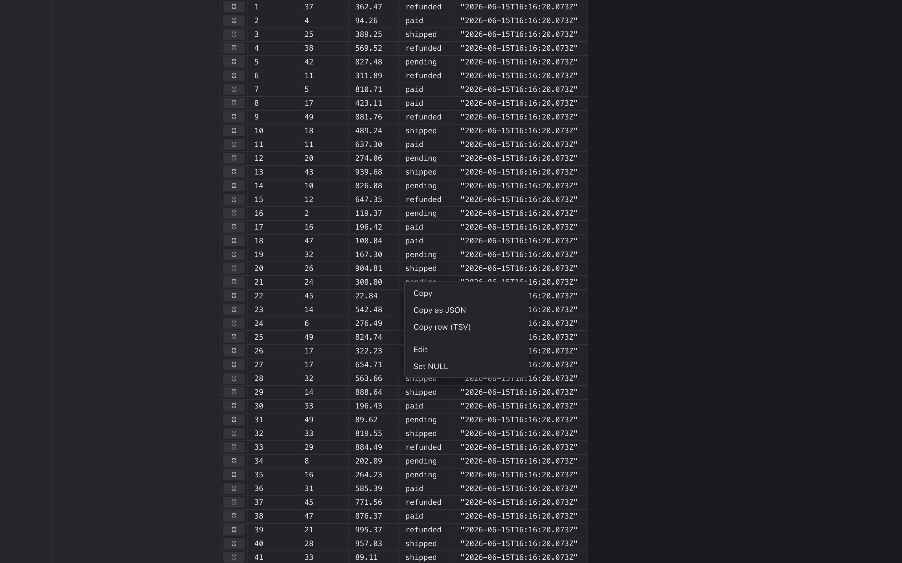
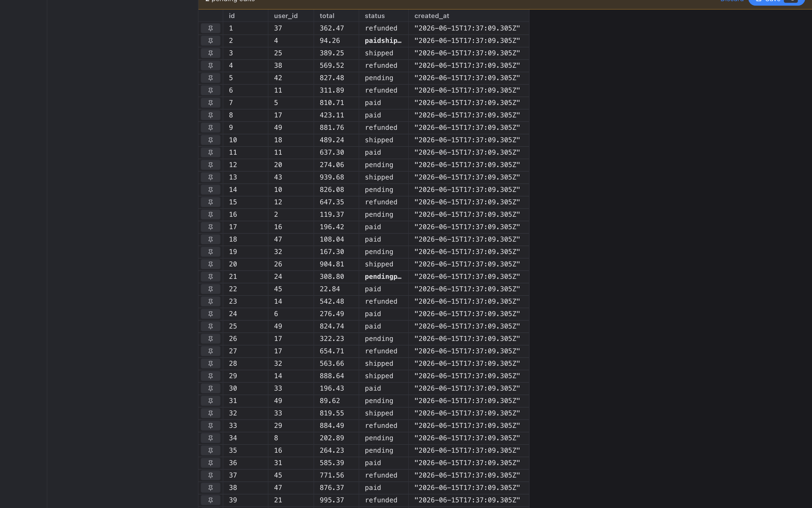
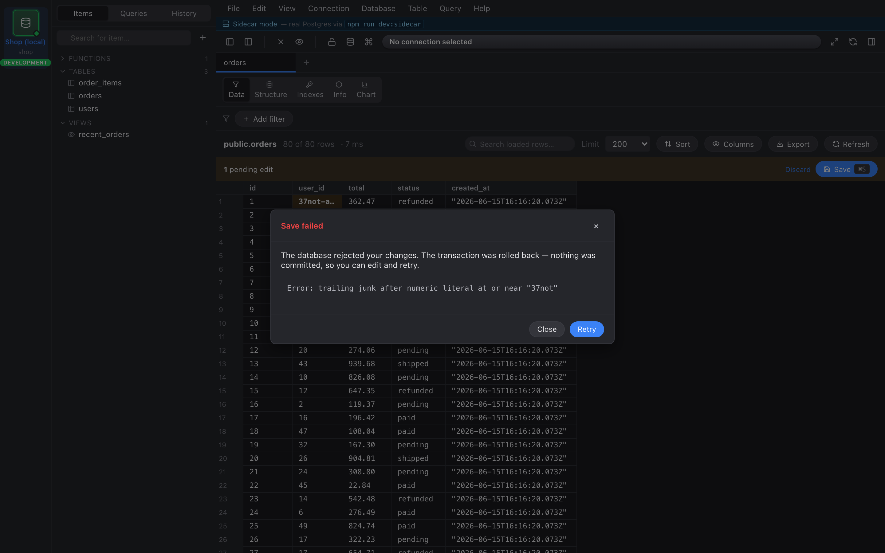

import { Aside } from "@astrojs/starlight/components";

## Click to copy, double-click to edit

- **Click** selects a cell; standard ⌘C / Ctrl+C copies the text.
- **Double-click** opens an inline editor.
- **Right-click** opens a menu: Copy, Copy as JSON, Copy row (TSV),
  Edit, Set NULL.



## Edits are pending until you save

Every edit you make is staged as a **pending edit** — the cell turns
yellow, but nothing's written to the database yet. A banner at the top
of the grid shows the count.



Press **⌘S** to commit them. Every pending edit goes out as a single
transaction:

```sql
BEGIN;
UPDATE "public"."users" SET "name" = 'Alice' WHERE "id" = 7;
UPDATE "public"."users" SET "email" = 'a@example.com' WHERE "id" = 7;
…
COMMIT;
```

If any single UPDATE fails, the whole transaction rolls back and a
modal pops up with the SQL error. Your pending edits stay queued so
you can fix and retry.



## Edits require a primary key

If the underlying table doesn't have a PK we can use, the right-click
**Edit** and **Set NULL** items grey out, and double-click does
nothing. This is intentional: without a PK we can't write an UPDATE
that's guaranteed to hit exactly one row.

<Aside type="caution">
Edits are **not** persisted across reload. Pending edits live on the
tab object in memory only — refresh, and stale PK references could
collide with rows that have changed since.
</Aside>

## Discarding edits

The banner has a **Discard** button that drops every pending edit
without writing anything. Same effect: switch the rail to a different
session and back, or close the tab.
