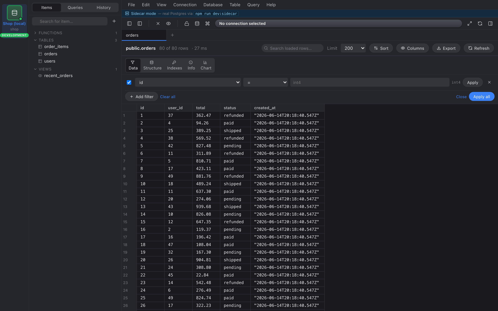

The filter builder sits directly under the data toolbar. It's the same
on every result grid, and every filter you add becomes a `WHERE` clause
on the underlying `SELECT`.

## Add your first filter

Click **+ Add filter** and the builder expands.

Each row has four things:

| | |
| ---: | --- |
| **Checkbox** | Enable / disable this filter. Disabled chips stay in the builder but don't appear in the SQL. |
| **Column picker** | All result columns of the current view. |
| **Operator** | See [Filter operators](../reference/filter-operators/) for the full list. |
| **Value** | Free text. Validated per column type — numeric columns reject letters, UUIDs reject malformed strings, JSON columns reject invalid JSON. |

Press Enter to apply just that one row, or click **Apply all** at the
bottom to commit every ready row at once.

## Operator categories

- **Comparison** — `=`, `≠`, `<`, `≤`, `>`, `≥`
- **Substring** — `contains`, `does not contain`, `contains (case-insensitive)`, …
- **Pattern** — `LIKE`, `ILIKE` (raw, no wildcard escaping)
- **Null** — `is null`, `is not null` (input greys out)

`contains` / `icontains` translate to `LIKE` / `ILIKE` with `%value%`
under the hood, **with `%` and `_` in your value escaped** so a literal
`50%` doesn't match every string with a `5`.

## Per-row Apply vs Apply all

Three buttons:

- **Apply** (per row) — commit just this filter and leave the rest
  alone. Useful when you want to layer filters incrementally.
- **Apply all** — commit every row that has a value. Rows you've
  typed half a value in get **disabled**, not dropped, so you can come
  back to them.
- **Clear all** — remove every filter chip and re-run the query.

## Filters persist

Active filters survive an app restart. They're stored on the tab, not
just in memory, so reopening tomorrow brings back exactly the same
view you closed today.
