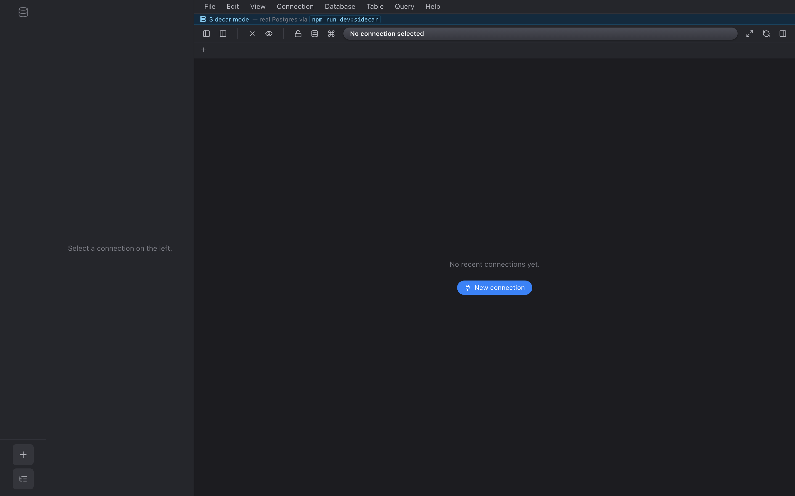
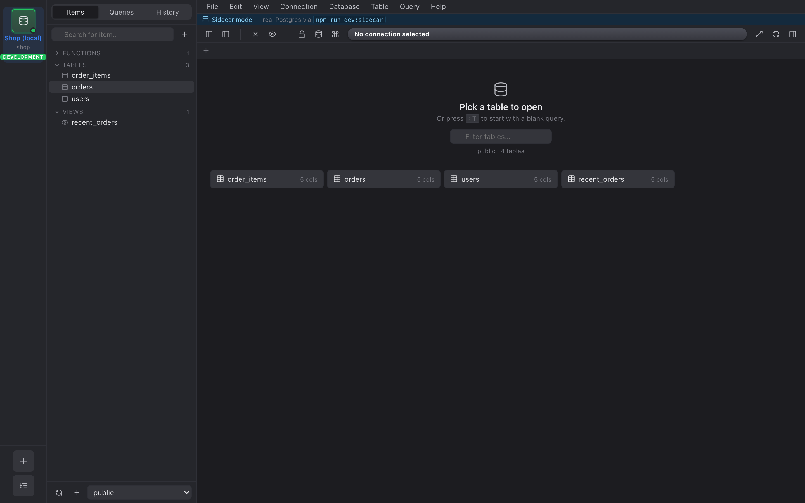

## 1. Ouvrir Nembrix

La première chose que vous verrez est un rail vide (la colonne d'avatars de
connexion à gauche) et un volet d'accueil affichant **Aucune connexion
récente pour l'instant**.

## 2. Enregistrer une connexion

Cliquez sur **Nouvelle connexion** dans le volet d'accueil (ou appuyez sur ⌘N).

Le formulaire de connexion est une seule boîte de dialogue en trois sections :

- **Général** — nom, hôte, port, utilisateur, mot de passe, base de données,
  mode SSL.
- **Groupe** — facultatif. Utilisez-le pour regrouper des connexions liées
  (par ex. « Acme prod », « Équipe Foo »).
- **Environnement** — Production / Staging / Développement / Test / Autre.
  Cela pilote la teinte de l'avatar et le flux de confirmation des requêtes
  destructrices. La Production reçoit un anneau rouge vif ; l'éditeur
  refusera un `DROP TABLE` dessus tant que vous n'aurez pas tapé le nom de la
  connexion.
- **Tunnel SSH** — facultatif, décrit dans [SSH](../ssh/).

Cliquez sur **Tester la connexion** pour vérifier avant d'enregistrer, ou sur
**Enregistrer & connecter** pour tout faire en une fois.

## 3. Choisir une table

Une fois connecté, l'inspecteur à droite affiche l'arbre du schéma.
Cliquez sur n'importe quelle table pour l'ouvrir dans un onglet.

Par défaut, chaque onglet charge les 200 premières lignes. Augmentez ce
nombre avec le menu déroulant **Limite** au-dessus de la grille.

## 4. Filtrer

Cliquez sur **+ Ajouter un filtre** sous la barre d'outils pour commencer une
puce de filtre. Chaque puce comporte une colonne, un opérateur (« = »,
« contient », « est nul », …) et une valeur. La case à cocher de la puce
l'active ou la désactive sans la supprimer.

[→ Filtres](../filters/)

## 5. Éditer une cellule

Double-cliquez une cellule pour l'éditer. La cellule devient jaune pour
signaler une « modification en attente » — et une bannière en haut de la
grille indique combien de modifications sont en file.

Appuyez sur ⌘S pour toutes les valider en une seule transaction. Les erreurs
Postgres remontent dans une fenêtre modale avec un bouton Réessayer.

[→ Édition des données](../editing-data/)

## 6. Enregistrer ce que vous avez tapé

Le titre de l'onglet de l'éditeur SQL se transforme en un point en italique
lorsqu'il y a des frappes non enregistrées. ⌘S dans l'éditeur enregistre la
requête sous un nom (les requêtes enregistrées se trouvent dans l'onglet
**Requêtes** de l'inspecteur).
