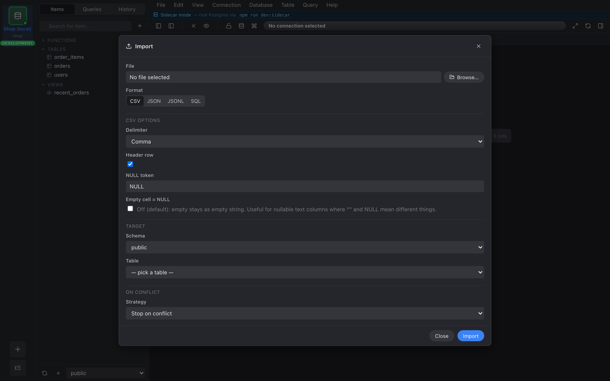
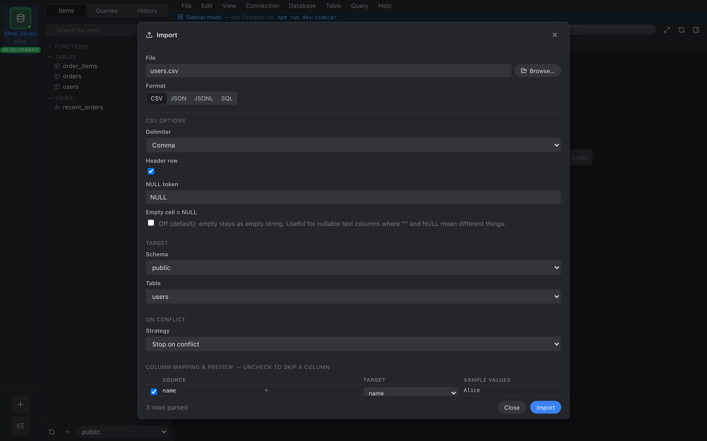

import { Aside } from "@astrojs/starlight/components";

On a `table_data` tab, the toolbar overflow menu has an
**Import…** entry. Pick a file and the import dialog opens.

## Format detection

Nembrix reads the first few KB of the file to detect the
format from extension and content sniffing. Supported: **CSV**,
**JSON** (array), **JSONL**, and **SQL** (passes through to the
query runner).

You can override the detected format from the picker at the top
of the dialog.

## CSV dialect options

When the format is CSV, the dialog exposes the dialect controls:

- **Delimiter** — `,`, `;`, `\t`, `|`, or custom.
- **NULL token** — string in the file that should be inserted as
  SQL `NULL`. Defaults to `NULL`.
- **Header row** — toggle. On = first row is column names; off =
  treat the first row as data and label columns `column_1`,
  `column_2`, ….
- **Empty cell = NULL** — toggle. On = an empty field becomes
  `NULL`; off = it becomes an empty string `''`.

Defaults are taken from your CSV preferences (see Preferences).

## Column mapping

The bottom half of the dialog is a table: one row per source
column, with **Source name**, **Sample values** (first three
distinct, non-null), an **Include** checkbox, and a **Target
column** dropdown of every column in the destination table.

Nembrix auto-maps by case-insensitive name match. Unmatched
source columns start unchecked.

## Conflict modes

A radio group at the bottom controls what happens on PK conflict:

- **Stop** — first conflict aborts the import. The transaction
  rolls back; nothing is inserted.
- **Skip** — emit `ON CONFLICT DO NOTHING`. Conflicting rows are
  silently skipped, the rest insert.
- **Update** — emit `ON CONFLICT … DO UPDATE SET …` for every
  included non-PK column. Effectively an upsert.

<Aside type="caution">
**Update** mode requires that the destination has a primary key
Nembrix can target. If it doesn't, the radio is disabled.
</Aside>
