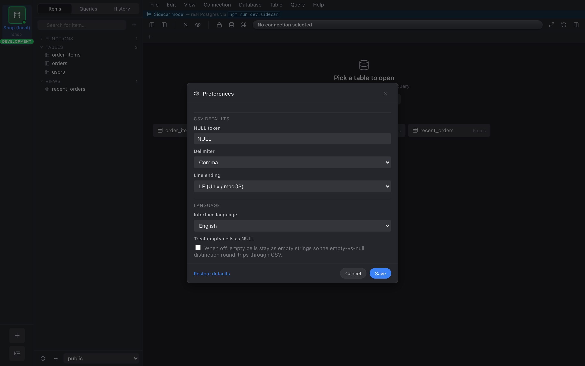

import { Aside } from "@astrojs/starlight/components";

Press **⌘,** to open the Preferences dialog. It's a single modal
with a left-side section nav.

## CSV defaults

The first (and currently only) section. These settings are the
defaults that the **Import** and **Export** dialogs read on open.
You can still override any of them per dialog — the preference is
just the starting point.

- **NULL token** — the string written for `NULL` on export and
  read as `NULL` on import. Default: `NULL`.
- **Delimiter** — character between fields. Default: `,`. Other
  common picks (`;`, `\t`, `|`) are in the dropdown, plus a
  free-form input for anything else.
- **Line ending** — `\n` (LF) or `\r\n` (CRLF). Default: `\n` on
  macOS / Linux, `\r\n` on Windows.
- **Empty cell = NULL** — toggle. When on, an empty CSV field is
  interpreted as SQL `NULL` on import and written as the NULL
  token on export. When off, empty stays empty. Default: off.

## Persistence

Every preference is persisted via **localStorage** under a single
namespaced key. Nothing here travels with your saved connections
or sessions — it's a per-browser-profile / per-install setting.

## Restore defaults

A **Restore defaults** button at the bottom of each section
resets just that section to its shipped defaults. It doesn't
touch any other section.

<Aside type="note">
More sections (editor, grid, theme) are planned and will use the
same persistence + Restore-defaults pattern.
</Aside>
