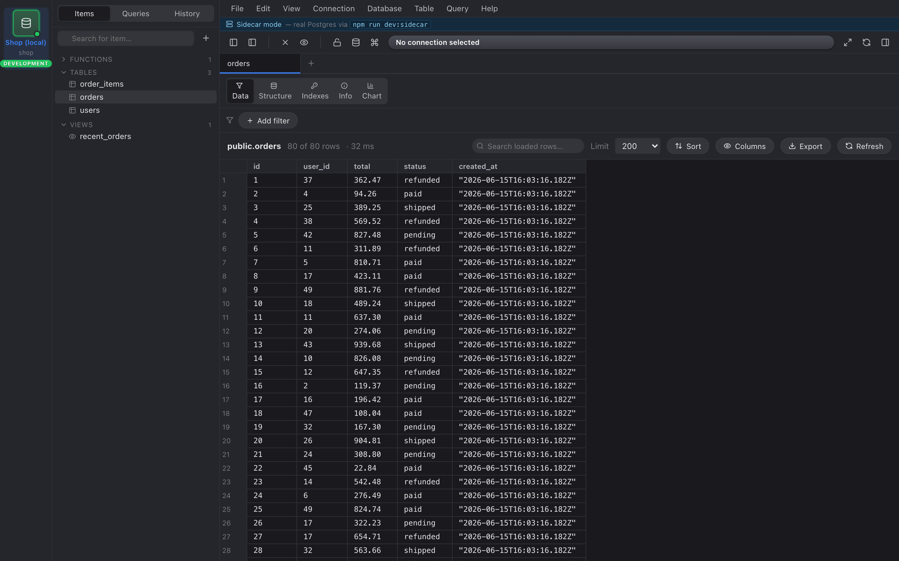

The result grid uses TanStack Virtual under the hood, so a million
rows costs the same as 200.

## Things you can do

- **Click a cell** to select; ⌘C copies the text.
- **Right-click a cell** for Copy / Copy as JSON / Copy row (TSV) /
  Edit / Set NULL. See [Editing cells](../editing-data/).
- **Click a column header** for a column summary (distribution,
  uniques, min/max, top values). Each top value is a one-click "filter
  by this".
- **Drag the right edge of a column header** to resize; widths persist.
- **Click the pin in the gutter** to pin a row to the top.
- **Quick search input** in the toolbar — substring search across
  the rows already loaded (not a SQL filter).

## Row count

The toolbar shows `N of M (est.) rows`:

- **N** — rows currently rendered (capped by Limit).
- **M** — total in the table. Two-phase fetch: first a planner
  estimate from `pg_class.reltuples`, then an exact `COUNT(*)` wrapped
  in `SET LOCAL statement_timeout = 2500` so huge tables don't hang
  the UI. The "(est.)" suffix disappears when the exact count lands.

## Empty results render too

If a query returns zero rows but the columns are known, the grid
still draws its header so you can see the schema. A centered "No
rows match — the table or query returned 0 results" hint floats over
the empty body.
