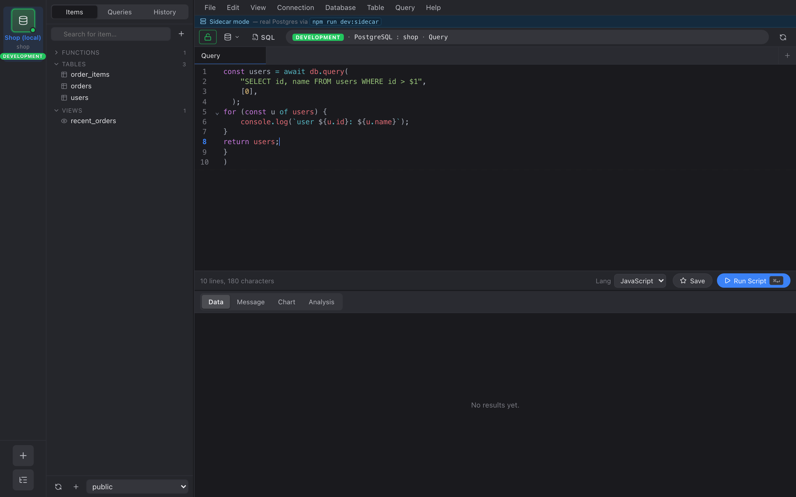

Beyond plain SQL, a **Query** tab can run **JavaScript** against your live
connection. Toggle the editor into script mode and write JS that queries
the database with `await db.query(...)`, loops, branches, and logs —
useful for per-row work, small migrations, and quick data munging that's
awkward in a single statement.

Scripting works on **SQL engines** (PostgreSQL / MySQL / SQLite) **and
MongoDB**. On SQL, `db.query(...)` takes SQL; on MongoDB it takes a
mongo-shell command string (`db.coll.find({…})`). The toggle is hidden for
Redis.



Switch a tab to scripting with the **Lang** picker in the editor toolbar
(SQL → JavaScript); the run button becomes **Run Script**. `console.log`
output appears in the **Console** strip below the results grid.

## Writing a script

```js
// Query returns an array of row objects.
const users = await db.query("SELECT id, email FROM users LIMIT 10");

for (const u of users) {
  // Per-row work, branching, anything JS can do.
  if (u.email.endsWith("@example.com")) {
    console.log(`internal user: ${u.id}`);
  }
}

// The last query's result (or a value you return) shows in the Data grid.
return users;
```

- **`await db.query(sql, params?)`** runs a query and resolves to an array
  of row objects (`{ column: value, … }`).
- **`console.log(...)`** output is captured and shown in the **Console**
  strip below the grid, in execution order.
- The **returned value** (or the last `db.query` result if you don't
  return one) renders in the **Data** grid, exactly like a normal query.

## MongoDB

On a MongoDB connection, `db.query(...)` takes a **mongo-shell command**
instead of SQL — the same syntax the Query tab accepts (`find`, `aggregate`,
`insertOne`, `updateMany`, …). The result is still an array of documents you
can iterate:

```js
const active = await db.query('db.users.find({ active: true })');
for (const u of active) {
  console.log(u.name);
}
return active;
```

Parameters are baked into the command object itself (there is no `$1`
placeholder binding for Mongo); build the filter/pipeline in the command
string.

## Parameters — always use `db.query(sql, params)`

Pass values as **positional parameters** (`$1`, `$2`, …) — they are
bound by the driver, never string-interpolated, so there's no SQL
injection risk:

```js
const email = "alice@example.com";
const rows = await db.query(
  "SELECT * FROM users WHERE email = $1",
  [email],
);
```

Do **not** build SQL by concatenating values into the string. Use params.

## Stopping a script

A running script can be stopped two ways:

- **Cancel** — click the **Cancel** button (it replaces Run while a
  script is running). The engine stops at the next step.
- **Timeout** — scripts have a wall-clock timeout (30&nbsp;seconds by
  default). A runaway loop such as `while (true) {}` is torn down
  automatically and the tab shows a *"script timed out"* error, so the
  app can't hang.

## What a script can and can't do

- ✅ Query the database (`db.query`), loop, branch, `console.log`.
- ❌ No filesystem, network, or `require`/`import` — the sandbox exposes
  only `db` and `console`. Scripts can't reach anything outside the
  database connection.
- Guards cap total rows and total queries per run, so an accidental
  unbounded loop terminates rather than exhausting memory.
