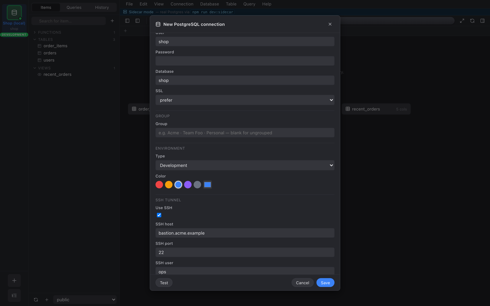

Toggle **Use SSH** in the connection form to open the SSH section.

## Auth

- **Password** — straightforward; stored in the keychain.
- **Key file** — point at a `.pem` / `.id_rsa`. Passphrase-protected
  keys prompt on connect; passphrase stored in the keychain.
- **Agent** — uses `SSH_AUTH_SOCK` on Unix or Pageant on Windows.
  Best option when you already have keys loaded.

## Host key verification

First connect to an unknown host shows a TOFU prompt with the
fingerprint and algorithm. **Trust this host** writes it to
`~/.ssh/known_hosts`. Subsequent connects verify silently; a key
mismatch shows a red warning and refuses to connect.

Strict host key checking is a per-connection toggle in the SSH
section.

## How it works

When you connect, we:

1. Open the SSH connection.
2. Bind `127.0.0.1:0` (random port) locally and start a
   `direct-tcpip` forwarder to `db_host:db_port`.
3. Tell the Postgres driver to connect to `127.0.0.1:<local_port>`.

Dropping the connection tears down the pool first, then the tunnel.
