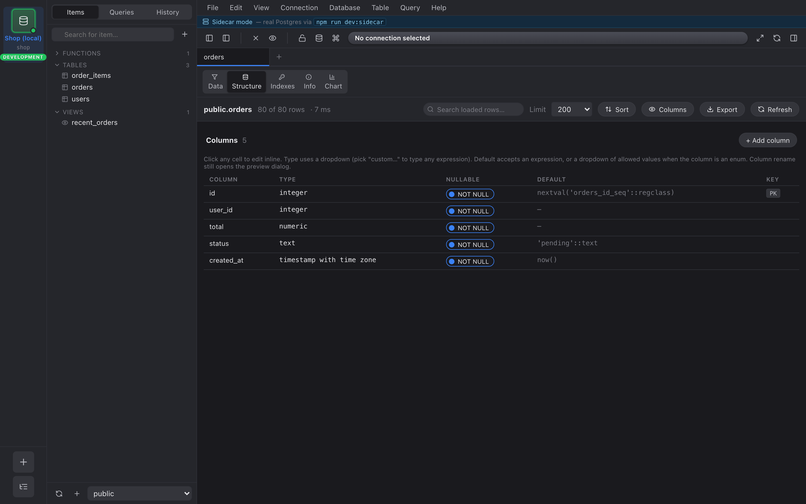
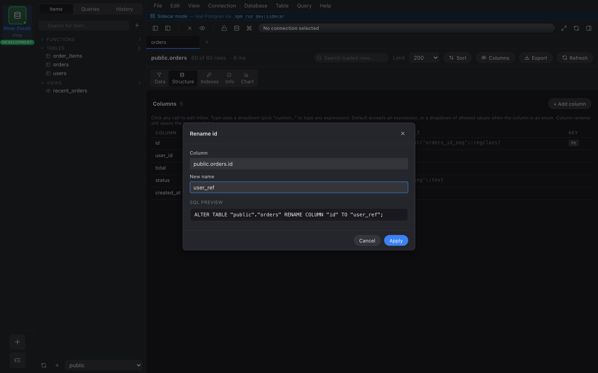

import { Aside } from "@astrojs/starlight/components";

Every `table_data` tab has a **Structure** tab next to **Data**.
It's the column list for the underlying table, rendered as a grid
you can edit inline.

## What you can edit inline

- **Type** — dropdown of `COMMON_PG_TYPES` (text, varchar, int4,
  int8, numeric, bool, timestamptz, date, json, jsonb, uuid, …)
  plus a **custom…** option at the bottom for anything not in the
  list. Pick `custom…` and you get a free-form input.
- **Default** — free-form text. Whatever you type is emitted
  verbatim into the `DEFAULT` clause, so `now()`,
  `gen_random_uuid()`, `'pending'::status`, and `42` all work.
- **Nullable** — toggle. Flips between `SET NOT NULL` and
  `DROP NOT NULL`.

If the column's type is a Postgres `enum`, the Default cell becomes
a dropdown of that enum's allowed labels instead of a free-form
input.

## Renames go through SQL preview

The **Name** cell is editable, but unlike Type/Default/Nullable, a
rename doesn't apply inline. It opens the SQL preview dialog with
the `ALTER TABLE … RENAME COLUMN` ready to run. This keeps a
mistyped name from silently breaking views and FKs that reference
it.

## Errors stay inline

If Nembrix can't apply a change — e.g. you set a column NOT NULL
on a table that has nulls in it — the error appears as a red
strip under the offending row. The cell stays in its edited state
so you can adjust and retry. Nothing else on the page is touched.

<Aside type="note">
Adding and dropping columns is on the same tab via the **+ Column**
button at the bottom and the row-level trash icon. Both route
through SQL preview before they apply.
</Aside>
